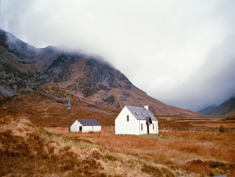

# MKL Colour transfer in Python

Colour transfer algorithm based on linear Monge-Kantorovitch solution

This code is a direct reimplementation of this previous MATLAB code:

https://github.com/frcs/colour-transfer/blob/master/colour_transfer_MKL.m

We also use the same demo image here, for a direct comparison.

<table style="width:100%">
<tr>
<td></td>
<td></td>
</tr>
<tr>
<td>input ref</td>
<td>input target</td>
</tr>
<tr>
<td></td>
<td></td>
</tr>
<tr>
<td>Linear Monge-Kantorovitch solution in RGB space</td>
<td></td>
</tr>
</table>

## Usage

    python demo.py

The output image will overwrite `result_MKL.png`
